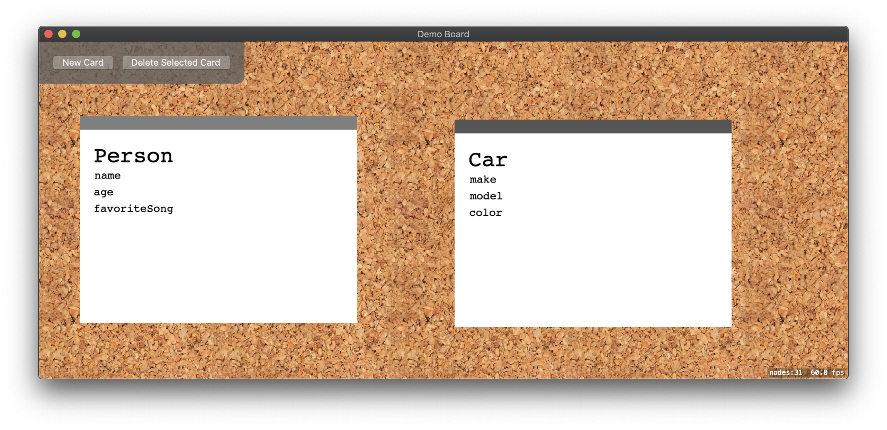

# Demo Board Cards

This is a *super* quick and dirty app (user experience/code quality is NOT really considered here at all!) simply thrown together to allow visualization of how objects come together for OOP. It is meant to be used by a teacher to visually demonstrate how objects and properties come together.

